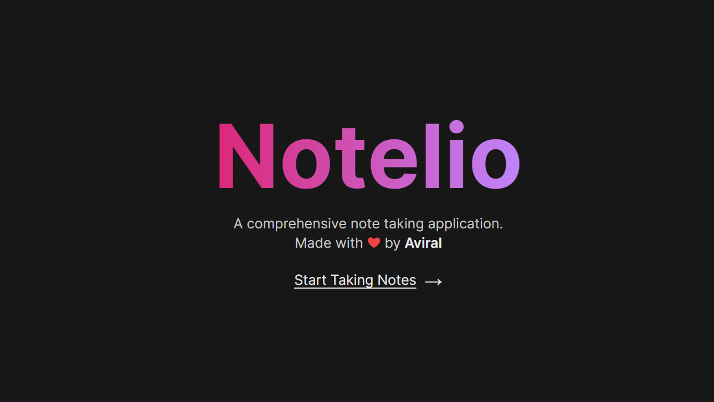

# 📝 Notelio
Notelio is comprehensive note taking web application which allow users to Create, Read, Update and Delete their notes. The website ensures complete authentication, guaranteeing the safety and security of all user notes.

<center>Stay organized, access notes on the go ✍️</center>



[Click here](https://notelio.vercel.app/) for live version

## 👨‍💻 Built With
* [](https://www.typescriptlang.org/)
* [](https://nextjs.org/)
* [](https://tailwindcss.com/)
* [](https://firebase.google.com/)

## Local Setup & Installation
* Clone the repo
```
$ git clone https://github.com/aviralj02/notelio
```
* Install packages
```
$ yarn install
```
* Create a `.env.local` file and fill up the details like in [.env.example](./.env.example)

* Spin up the development server
```
$ yarn dev
```